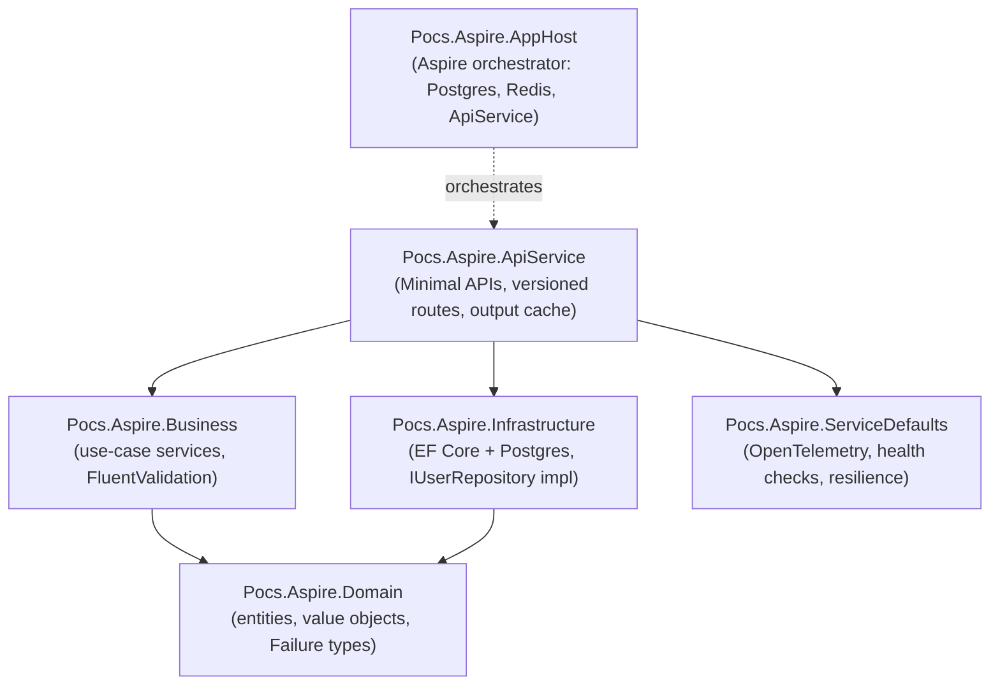
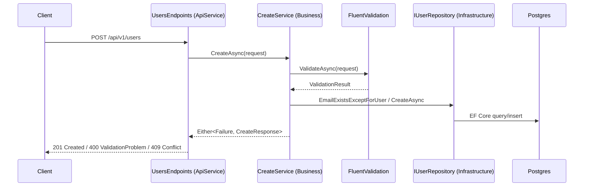

# AGENTS.md

Audience: engineers and AI coding agents. This is a **.NET Aspire
test/experimentation POC** — a sandbox for trying Aspire orchestration, clean
architecture, and functional-style error handling. Not production software;
optimize for clarity over completeness.

## Architecture

Clean Architecture, one project per layer. Dependencies point inward only.

`Domain` has no dependencies on anything else — it stays persistence- and
framework-ignorant. `Business` depends only on `Domain` abstractions
(`IUserRepository`, `IUnitOfWork`), never on `Infrastructure` directly (DI wires
the concrete `UserRepository` at `ApiService` startup).

### Request flow

Business services always return `LanguageExt.Either<Failure, TResponse>` (never
throw for expected failure paths). Endpoints pattern-match `result.Case` into the
matching HTTP response — see `UsersEndpoints` in `ApiService/Endpoints`.

## Technologies

| Concern | Library |
|---|---|
| Orchestration | .NET Aspire (`Aspire.Hosting.*`) |
| HTTP API | ASP.NET Core Minimal APIs |
| API versioning | `Asp.Versioning.Http`, URL-segment (`api/v{version}/...`) |
| Persistence | EF Core 9 + Npgsql (Postgres), migrations applied at startup |
| Caching | Redis via `Aspire.StackExchange.Redis.OutputCaching` |
| Validation | FluentValidation |
| Error handling | LanguageExt (`Either<Failure, T>`, `Option<T>`) — no exceptions for expected failures |
| Observability | OpenTelemetry (traces, metrics, logs) via `ServiceDefaults` |
| API docs | Swashbuckle (Swagger/OpenAPI) |
| Test isolation | Testcontainers (Postgres, integration tests) |
| Assertions | **Shouldly** (`ShouldBe`, `ShouldBeEquivalentTo`) — free; do not introduce FluentAssertions v8+ (commercial) |
| Mocking | NSubstitute (unit tests only) |
| Test runner | xUnit v3 |

## Where things live

- `src/Pocs.Aspire.Domain/` — entities, value objects, `Failure` types, repository
  and unit-of-work abstractions. Feature folders under `Users/`.
- `src/Pocs.Aspire.Business/` — one folder per use case (`Users/Create`,
  `Users/GetById`, `Users/Update`), each with its service, validator, and mapper.
- `src/Pocs.Aspire.Infrastructure/` — EF Core `AppDbContext`, configurations,
  migrations, repository implementations.
- `src/Pocs.Aspire.ApiService/` — Minimal API endpoints in `Endpoints/`; all
  user-facing routes are URL-segment versioned under `api/v{version}/...`.
- `src/Pocs.Aspire.AppHost/` — Aspire orchestration entry point.
- `src/Pocs.Aspire.ServiceDefaults/` — shared telemetry, health, resilience wiring.
- `tests/` — `*.Tests.Functional` (real Aspire app via `AspireHostFixture`),
  `*.Tests.Integration` (real Postgres via Testcontainers), `*.Tests.Unit`
  (NSubstitute mocks, guard clauses only).

Detailed coding and testing conventions load on demand from `.claude/rules/`.
Code is the source of truth — read it rather than duplicating it here.
