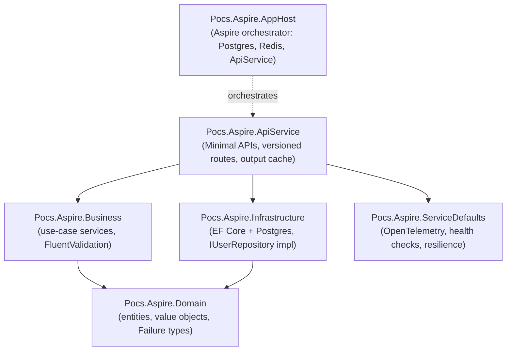
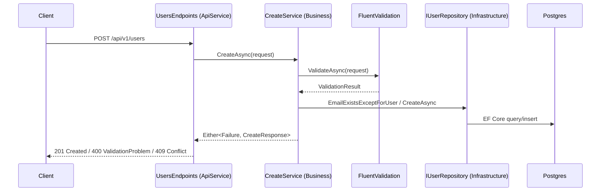

# AGENTS.md

Audience: AI coding agents. This is a **.NET Aspire test/experimentation POC** — a
sandbox for trying Aspire orchestration, clean architecture, and functional-style
error handling. Not production software; optimize for clarity over completeness.

## Architecture

Clean Architecture, one project per layer. Dependencies point inward only.

`Domain` has no dependencies on anything else — it stays persistence- and
framework-ignorant. `Business` depends only on `Domain` abstractions
(`IUserRepository`, `IUnitOfWork`), never on `Infrastructure` directly (DI wires
the concrete `UserRepository` at `ApiService` startup).

### Request flow

Business services always return `LanguageExt.Either<Failure, TResponse>` (never
throw for expected failure paths). Endpoints pattern-match `result.Case` into the
matching HTTP response — see `UsersEndpoints` in `ApiService/Endpoints`.

## Technologies

| Concern | Library |
|---|---|
| Orchestration | .NET Aspire (`Aspire.Hosting.*`) |
| HTTP API | ASP.NET Core Minimal APIs |
| API versioning | `Asp.Versioning.Http`, URL-segment (`api/v{version}/...`) |
| Persistence | EF Core 9 + Npgsql (Postgres), migrations applied at startup |
| Caching | Redis via `Aspire.StackExchange.Redis.OutputCaching` |
| Validation | FluentValidation |
| Error handling | LanguageExt (`Either<Failure, T>`, `Option<T>`) — no exceptions for expected failures |
| Observability | OpenTelemetry (traces, metrics, logs) via `ServiceDefaults` |
| API docs | Swashbuckle (Swagger/OpenAPI) |
| Test isolation | Testcontainers (Postgres, integration tests) |
| Assertions | **Shouldly** (`ShouldBe`, `ShouldBeEquivalentTo`) — free; do not introduce FluentAssertions v8+ (commercial) |
| Mocking | NSubstitute (unit tests only) |
| Test runner | xUnit v3 |

## Rules for implementing a feature

**Comments are a last resort, not documentation.** Code must read clearly
without narration.
- Do not add comments that describe *what* a line does or *how* something
  works — if the code needs that, extract a well-named private method instead
  (SOLID: single responsibility, self-documenting names).
- Keep `// Arrange` / `// Act` / `// Assert` markers in tests, bare — no
  appended narration.
- A rare inline `//` is acceptable only for something genuinely non-obvious
  (a magic number's origin, a framework quirk) that naming can't express.
- `///` XML doc comments describe WHAT/WHY, never HOW or implementation
  detail. They earn their keep most on interfaces (`IUserRepository`,
  `ICreateService`, ...), less so on trivial constructors.

**Testing is functional-first.**
- Prefer functional tests (`Pocs.Aspire.ApiService.Tests.Functional`, driven
  through `AspireHostFixture` — a real Aspire distributed app, real HTTP
  calls, real Postgres/Redis via Testcontainers) and integration tests
  (`Pocs.Aspire.Infrastructure.Tests.Integration`, real Postgres via
  Testcontainers) over mocked unit tests.
- Reserve `Pocs.Aspire.Business.Tests.Unit` (NSubstitute mocks) for paths a
  functional test structurally cannot reach — guard clauses like
  constructor null-checks that DI never triggers in the running app.

**Assertions cover the whole object.**
- When the thing under test returns a complex value (`Option<T>`,
  `Either<Failure, T>`, an entity, a DTO), build a complete `expected` value
  and assert the whole object (`actual.ShouldBeEquivalentTo(expected)`), so
  every mapping is exercised — not just one flag (e.g. don't assert only
  `result.IsNone.ShouldBeTrue()`; compare against `Option<User>.None`).
- Reserve single-property/scalar asserts for genuinely simple values (an
  HTTP status code, a count, a boolean flag that isn't backed by a mapped
  object).

**Versioned routing convention.**
- All user-facing routes live under `api/v{version:apiVersion}/...`, wired
  via `NewApiVersionSet()` / `WithApiVersionSet()` on the endpoint group in
  `UsersEndpoints`. A new endpoint group must declare its own version set
  the same way; don't add unversioned routes alongside it.

## Running things

Docker for this repo's tests runs inside a WSL distro; the Windows .NET SDK
cannot reach that WSL Docker socket. To run tests locally on Windows: build
normally, then execute the compiled test assemblies from inside WSL against
the local Docker socket (`dotnet exec <path-to-test-dll>` — `dotnet test`
can crash under xUnit v3's in-process launcher there).
